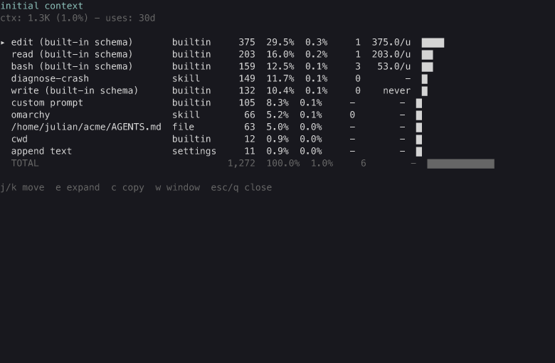

# initial-context extension

The token breakdown of the running agent's initial context: the system
prompt and the tool definitions, which are resent to the model on every
LLM call. One row per section and per tool, with token counts,
percentages, and bars. Tool rows also show the tool's call count in a
usage window (the last 30 days by default), so the cost of a tool can be
weighed against how often it is used.

## Screenshot

The `/ctx` view: one row per section and per tool, with tokens,
percentages of the context window, and the 30-day tool call counts.

## /ctx (TUI)

Opens the breakdown. There is one row per part: the base prompt (or
custom prompt), the append text, project instruction files, skills, the
cwd line, a prompt injection when another extension touched the prompt,
and each tool. Rows are sorted by size, largest first.

Every row shows its source (builtin, settings, file, skill, or extension;
a tool is builtin or the extension that added it), its token count, its
share of the initial context total, its share of the context window, and
a bar. Tool rows additionally show their call count in the usage window.
Skill rows show how often the agent loaded that skill's SKILL.md (a rough
proxy: it counts the load, not the outcome). The other section rows show
`-`, and TOTAL sums the tool calls.

With a usage view, a derived **waste** column appears (TUI and text):
for a tool row with uses in the window it shows the cost a use pays
(tokens per use), and for a tool row with zero uses it shows `never`,
the mark that started the review of issue #72. The value is computed in
the pure renderer from data the report already carries (the row's tokens
and its call count); the usage scan and the window logic are untouched.
Section rows and TOTAL show `-`.

The usage window is the last 30 days by default. `w` cycles
30d → 90d → all. In headless modes the command takes the window as an
argument: `/ctx 90d`, `/ctx all`.

| Key | Action |
| --- | --- |
| `j` / `k` | move the cursor (scroll the pane when expanded) |
| `e` | expand the row to the exact text, or collapse |
| `c` | copy the expanded row, or the whole breakdown |
| `w` | cycle the usage window (30d, 90d, all) |
| `esc` / `q` | close |

Expanding the `mcp` row lists its per-subtool split (`mcp` calls with a
`tool` argument count as that subtool; `connect`, `describe`, and
`search` count as plain `mcp`).

A footer status line keeps the total visible without opening the view:
`ctx: 45.2K (11.3%)`. The count is compact and uses the system locale's
number format.

In headless modes the command prints the same breakdown as plain text:
a notify record in RPC mode, the console in print mode.

## How the numbers are built

The prompt rows come from the same structured inputs pi uses to build
the system prompt (base template, append text, project files, skills,
cwd). Tool rows come from the tool entries actually sent to the
provider, captured read-only from the last provider request payload.
Before the first call, built-in schemas are rebuilt from pi's exported
tool factories and marked `built-in schema`; tools that cannot be
resolved are listed by name with `waiting for first call`.

Token counts use pi's own estimator (chars / 4), so every row shares one
consistent scale. The first assistant response also records the input
tokens the provider reported, shown as a reference line. It is display
only: the bar and percentages stay comparable across rows.

If other extensions append to the prompt, an injection row shows the
suffix; anything else that changes the prompt is flagged
`modified by extension`.

## How the uses column is built

The counts are derived from the session files: a tool call is a
`toolCall` item inside an assistant message, and a fork-copied line
counts once (ADR 0009). A skill load is a tool call whose arguments
reference the skill's SKILL.md, by path; the skill name is read off the
directory that holds the file. The scan runs in the background on the
first `/ctx`; the dialog shows a counting state until it settles. A
scan that fails settles to an error state, and the next `/ctx` re-runs it. A
per-file cache keyed on mtime and size
(`~/.pi/agent/tool-usage-cache.json`, override `PI_TOOL_USAGE_CACHE`)
makes every later open near instant and window switches a filter on
cached events; the cache is a pure function of the session files, never
a source of truth (ADR 0014). The sessions root is
`~/.pi/agent/sessions`, override `PI_SESSIONS_DIR`.

This extension registers no tools, no prompt text, and no prompt notes
of its own, so its own overhead is zero.

## Files

- `context.ts` - pure core: row construction, payload parsing, injection
  detection, token estimation, plain-text rendering
- `tool-usage.ts` - the tool usage scan, cache, and windows
- `tui.ts` - the TUI view
- `index.ts` - event wiring and the `/ctx` command
