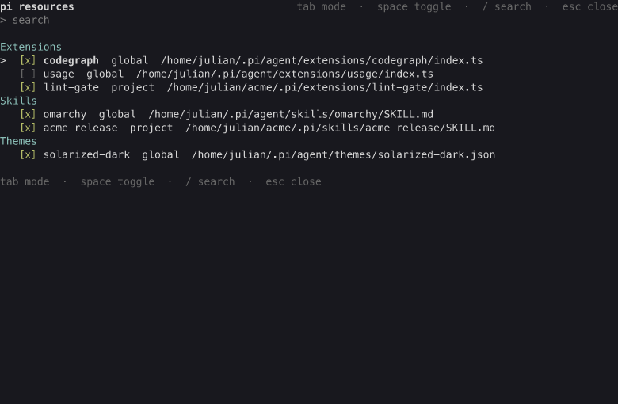

# resource-toggle extension

Enable and disable extensions, skills, prompt templates, and themes from
inside a running session, without editing settings files by hand.

- `/resources` opens the interactive list in TUI mode (a text table in the
  headless modes).
- `/enable <name>`, `/disable <name>`, and `/inherit <name>` change the
  state of one named resource; `--project` selects project mode, `--global`
  is the default.
- The `resource_toggle` tool lets the agent list resources and apply
  changes on request; with no arguments it opens the interactive list.

State lives in pi's native settings override patterns - the same files and
the same format `pi config` uses
([ADR 0012](/adr/0012-resource-toggles-write-native-settings-patterns)).
The commands and `pi config` are interchangeable: a change made in one shows
up in the other.

## Screenshot

The interactive list with the fixture resource set, grouped by type. The
checkbox shows the state in the current mode; the `usage` extension is
disabled by a settings pattern, so its box is empty.

## Behavior

- **Write modes.** Global mode writes the global settings
  (`<agent dir>/settings.json`); project mode writes the project settings
  (`<cwd>/.pi/settings.json`). A project resource can be overridden in
  project mode; `inherit` clears that override so the resource returns to
  the global state. `inherit` has no global mode.
- **Immediate effect.** Every change flushes the settings and reloads the
  session, so the change applies at once and survives a restart. The
  reload rebinds every extension, so the in-session state of other
  extensions resets.
- **Self-guard.** The extension refuses to disable or clear itself: doing
  so would remove the toggle commands from the session.
- **Name matching.** A name may be a display name, a unique name prefix,
  or a path fragment. A name that matches several resources is reported
  as ambiguous with the candidates listed; a name that matches none is
  reported as not found.
- **Trusted projects only.** Project mode requires a trusted project; in
  an untrusted project the TUI shows the restriction and project commands
  are refused.
- **Headless modes.** In print and RPC modes `/resources` prints the table
  and the state commands work with a console report; the interactive list
  is TUI mode only.

## Out of scope

- Installing or removing resources (enabling and disabling only).
- Per-session (non-persisted) toggles: every change is written to
  settings.
- Toggling pi's built-in tools. The [tools extension](/extensions/tools)
  covers built-in tools.

## Tests

- `tests/resource-toggle/matcher.test.ts` - name matching and ambiguity.
- `tests/resource-toggle/resolver.test.ts` - resource discovery across
  scopes.
- `tests/resource-toggle/state-machine.test.ts` - the pattern transitions
  for enable, disable, and inherit in both write modes.
- `tests/resource-toggle/tui.test.ts` - the interactive list rendering.
- `npm run e2e:resource-toggle` - a real pi RPC session: list, toggle,
  reload, and the self-guard.
