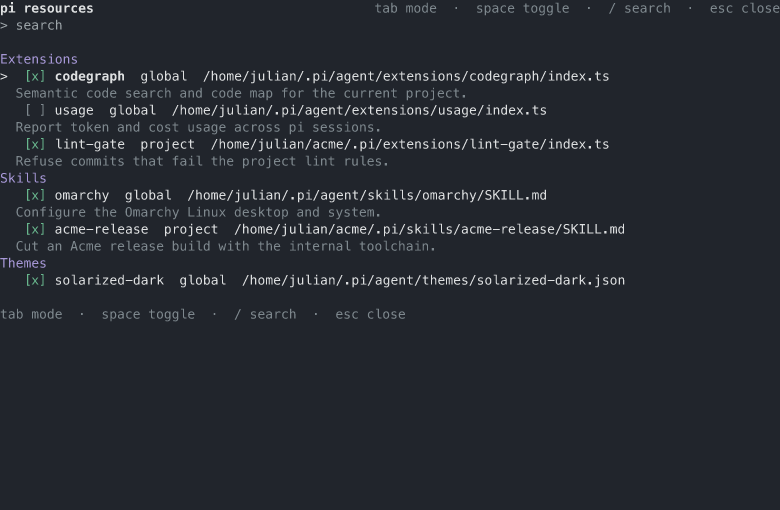

# resource-toggle extension

Enable and disable extensions, skills, prompt templates, and themes from
inside a running session, without editing settings files by hand.

- `/resources` opens the interactive list in TUI mode (a text table in the
  headless modes).
- `/enable <name>`, `/disable <name>`, and `/inherit <name>` change the
  state of one named resource; `--project` selects project mode, `--global`
  is the default.
- A state command with no name opens the resource picker in TUI mode: a
  searchable single-pick list of every resource, filterable by name, path,
  or kind. A pick applies the toggle of that command in the active mode
  and closes on success; a no-op pick, a single-file package refusal, or a
  self-guard refusal says why and keeps the picker open. In RPC and print
  modes the command prints the resource table instead.
- While typing a state command, matching display names autocomplete
  inline, each with the resource's description.
- The `resource_toggle` tool lets the agent list resources and apply
  changes on request; with no arguments it opens the interactive list, and
  an action without a name relays the no-argument command, so the picker
  opens for the user.

State lives in pi's native settings override patterns - the same files and
the same format `pi config` uses
([ADR 0012](/adr/0012-resource-toggles-write-native-settings-patterns)).
The commands and `pi config` are interchangeable: a change made in one shows
up in the other.

## Screenshot

The interactive list with the fixture resource set, grouped by type. The
checkbox shows the state in the current mode; the `usage` extension is
disabled by a settings pattern, so its box is empty. The dimmed line under
a resource is its description, derived from the source file.

## Behavior

- **Write modes.** Global mode writes the global settings
  (`<agent dir>/settings.json`); project mode writes the project settings
  (`<cwd>/.pi/settings.json`). A project resource can be overridden in
  project mode; `inherit` clears that override so the resource returns to
  the global state. `inherit` has no global mode.
- **Immediate effect.** Every change flushes the settings and reloads the
  session, so the change applies at once and survives a restart. The
  reload rebinds every extension, so the in-session state of other
  extensions resets.
- **Self-guard.** The extension refuses to disable or clear itself: doing
  so would remove the toggle commands from the session.
- **Name matching.** A name may be a display name, a unique name prefix,
  or a path fragment. A name that matches several resources is reported
  as ambiguous with the candidates listed, each with its description; a
  name that matches none is reported as not found.
- **Package resources.** A resource bundled in a package is toggled by a
  filter in the packages array of the settings
  ([ADR 0029](/adr/0029-package-toggles-write-packages-array-filters)), not
  by a resource-array pattern. A local source is rewritten relative to the
  project directory so the project file stays portable. Toggling a resource
  from a single-file package source is refused with a clear message: pi
  loads a single-file source unconditionally, so its state cannot be
  toggled.
- **Descriptions.** The one-line description of a resource is derived from
  its source file at list time, never stored: the skill `SKILL.md`
  frontmatter `description`, the prompt template frontmatter `description`
  falling back to the first non-empty line, and the leading block comment
  of an extension entry file (a BOM or shebang line may precede it). The
  description shows in the picker, the completion list, the interactive
  list, the headless table, and the ambiguous-name candidates; it is
  capped at 60 characters in the table, and themes have no description.
- **Trusted projects only.** Project mode requires a trusted project; in
  an untrusted project the TUI shows the restriction and project commands
  are refused.
- **Headless modes.** In print and RPC modes `/resources` prints the table
  and the state commands work with a console report; the interactive list
  is TUI mode only.

## Out of scope

- Installing or removing resources (enabling and disabling only).
- Per-session (non-persisted) toggles: every change is written to
  settings.
- Toggling pi's built-in tools. The [tools extension](/extensions/tools)
  covers built-in tools.

## Tests

- `tests/resource-toggle/matcher.test.ts` - name matching, ambiguity, and
  the argument-completion items.
- `tests/resource-toggle/resolver.test.ts` - resource discovery across
  scopes and the description derivation per resource kind.
- `tests/resource-toggle/state-machine.test.ts` - the pattern transitions
  for enable, disable, and inherit in both write modes.
- `tests/resource-toggle/tui.test.ts` - the interactive list rendering.
- `npm run e2e:resource-toggle` - a real pi RPC session: list, toggle,
  reload, the self-guard, the packages-array filter cycle (including the
  self-heal and a tilde-spelled local source), the single-file refusal,
  the no-name resource table, and the tool relay of a no-name action.
