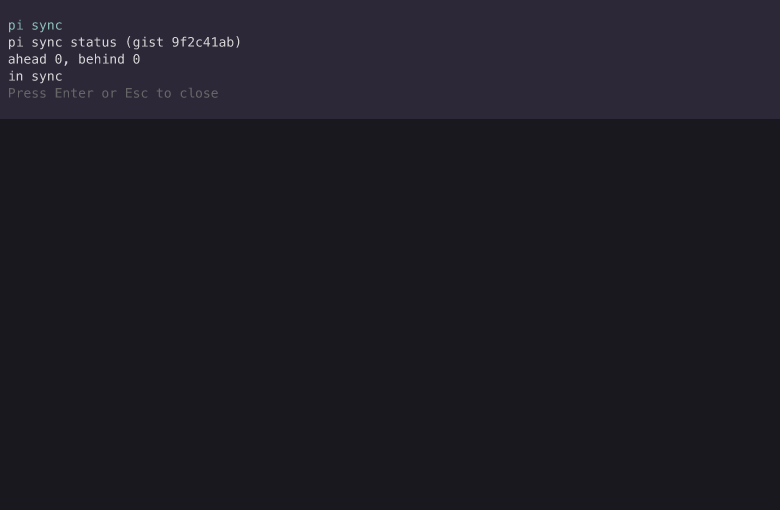

# sync extension

Keeps the user's pi config (the files named in a default-deny sync
manifest) in sync across devices through a pluggable Backend. v1 ships
exactly one backend: a **secret GitHub Gist**. The Backend is a single
seam, so a later backend (S3, Syncthing, rsync) is a new implementation,
not a redesign. `push` and `pull` run a three-way merge (the device's
last-synced base, local, remote); a same-second conflict keeps the local
side, and every overwritten file gets a `<path>.<millis>.bak` backup.
`push` uploads the merged tree before it touches the local tree, so a
network failure leaves the tree intact.

[Internals](/extensions/sync/internals): the manifest, the merge
semantics, the token lifecycle, and the Gist backend reference.

## Screenshots

The `/sync status` view in the TUI, with the device in sync:



The same status from the `pi-sync status` CLI:


## Onboarding (one command per device)

The whole setup is a guided wizard. Each human action is either one
browser page or one key press.

**Once per account (the only account-level step):**

```bash
scripts/setup-sync-wizard.sh
```

The bash wizard opens the GitHub OAuth app page, walks the form (name,
a `http://127.0.0.1` callback URL that is never used, the **Use
expiring tokens** checkbox that ADR 0007 needs, and the **device flow
opt-in** box that GitHub now requires on every app), and stores the
public **client id** in `<state-dir>/oauth-client.json`. Before it stores
the id it verifies it against GitHub: a live id gets a throwaway device
code, a typo is caught on the spot, and an app that left the device flow
off is named by GitHub's own `device_flow_disabled` refusal - the wizard
opens the settings page where the opt-in box lives (offline or without
`curl` the check degrades to a warning and a confirm). A client secret is
never created or stored: the device flow does not use one. Scripted
contexts can set `PI_SYNC_OAUTH_CLIENT_ID` instead.

**On each device:**

```bash
pi-sync init             # first device: create the shared secret gist
pi-sync init <gist-id>   # every later device: join that gist
pi-sync push             # upload this device's changes (merged)
pi-sync pull             # take the other devices' changes
pi-sync status           # ahead / behind / conflict, no side effects
```

What `init` does, step by step:

1. **Auth.** With no token on the device, the CLI runs the GitHub
   **OAuth device flow** (ADR 0007): it prints a short code and the
   verification URL (`github.com/login/device`), and polls. You open the
   URL in a browser and enter the code; the token it stores carries only
   the `gist` scope. On expiry or denial it offers exactly one fresh
   retry, or cancels. It never fails silently and never retries without
   you.
2. **Preview.** Before anything is written, the wizard prints the
   preview: which files are in scope, which files would be sent or
   replaced, and which files would arrive. The gist is created, and a
   device joins, only after you confirm with `y`. Declining writes
   nothing (the stored token excepted, if the flow already finished).
3. **Report.** The create path prints the gist id and the exact join
   command for the other devices. The join path prints the files it
   adopted.

In pi, the same wizard runs as `/sync init [gist-id]`: the device flow
is a TUI dialog, and the preview confirm is a TUI dialog.

### Flags

| Flag | Effect |
| --- | --- |
| `--yes` | Confirm the preview without prompting; the preview is still shown. Non-tty runs (CI, scripts) need this. |
| `--force` | Re-init an already-joined device without prompting. The shared tree re-adopts; the local manifest keeps its gist id. |

## Operations

All five exist as pi commands (`/sync ...`, with a TUI status dialog)
and as CLI verbs (same code, `extensions/sync/ops.ts`):

| Verb | Effect |
| --- | --- |
| `pi-sync init` (no id) | The create path: on auth, preview, and confirm, it creates the shared secret gist from this device's tree. |
| `pi-sync init <gist-id>` | The join path: on auth, preview, and confirm, this device adopts the shared tree and records the gist id. On an already-joined device it re-adopts like a pull (the preview lists what will be replaced; local edits are kept) and confirms again; `--force` skips the confirm. |
| `pi-sync push` | Merge local + remote, upload the merged tree, then apply the merge to the local tree. On a device that never ran `init`, push is a plain error pointing at `pi-sync init`: it never creates. |
| `pi-sync pull` | Merge local + remote and apply to the local tree. |
| `pi-sync status` | The merge without side effects: ahead / behind / conflict. |

`push` uploads **first**: a network failure leaves the local tree
untouched. Unreadable files and non-text files are skipped with a
warning line in the report, so a partial or binary-laden tree never
silently goes out wrong. The device-local base is recorded only after
the local apply succeeds, so a push whose apply fails cannot leave a
half-merged tree labeled "in sync".

## In a pi session

`/sync init [gist-id]`, `/sync push`, `/sync pull`, and `/sync status`
open a TUI dialog with the full report (in print and RPC modes the
report goes to the stream); `/sync` alone prints the usage. `/sync init`
runs the same wizard as the CLI: the device flow as a TUI dialog (it
only starts in the TUI, never in print or RPC modes), the preview
confirm as a dialog.

On session start, a joined device gets a footer line with the
ahead/behind counts when the tree has moved:

```
sync: ↑2 ↓1
```

A green up-arrow plus count when ahead, a red down-arrow plus count when
behind, both when the device drifts both ways. The line sits on the right
of the shared footer status line (see `shared/status-line.ts`), in the
column above the provider and model.

When a token exists but this device has not joined a gist yet, the line
nudges instead of staying empty:

```
sync: not joined - run /sync init
```

No token, zero drift, or a failed read: the line stays empty. The probe
only reports - it never starts a re-authentication or device flow - and
nothing on startup ever mutates the tree or the backend.
