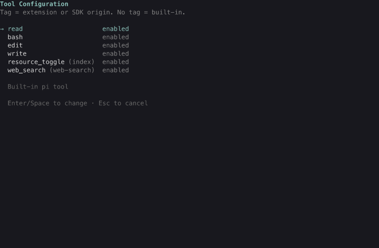

# tools extension

The `/tools` command opens a TUI list of every tool in the session.
Toggle a tool to enable or disable it; the change applies immediately.
The selection persists in the session (a `tools-config` entry) and is
restored on session start and branch navigation, so it respects the
session tree. Non-built-in tools show a tag with their origin (package
name or file name), so you can see which extension provides each tool.

## User-only tools start inactive

Two tools are **user-only** (CONTEXT.md, "Tool exposure"): the operator
gets the capability as a command, and the agent tool form should not pay
a context cost by default. The extension carries a default-disabled list
(`usage_report`, `resource_toggle`), applied on session start and branch
navigation only when the branch has no saved selection: a new session
starts with the listed tools inactive, and `/tools` can enable either for
that session. A saved selection always wins: once the operator makes a
choice in `/tools`, it is restored exactly on start and tree navigation,
and the defaults are not applied on top. The list is code, not a settings
entry - the extension API has no settings reader, and one line per tool
is the size of the decision (issue #72).

The command requires TUI mode; in print or RPC modes it reports that.

## Screenshot

The list with the fixture tool set: built-in tools, a package extension
tool tagged with its origin, and a local extension tool tagged with its
file name.

