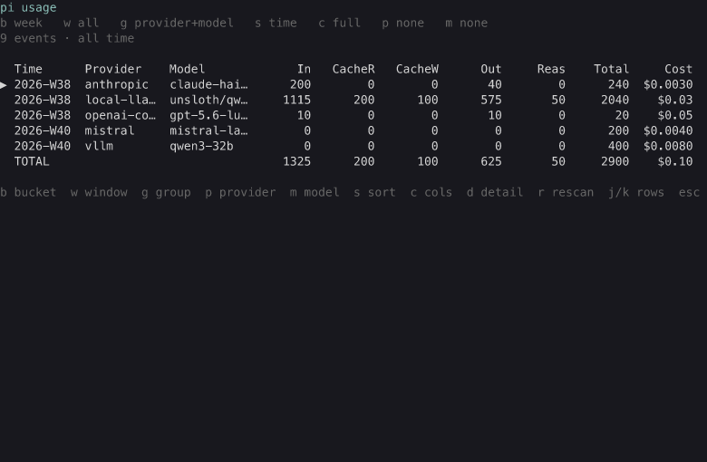
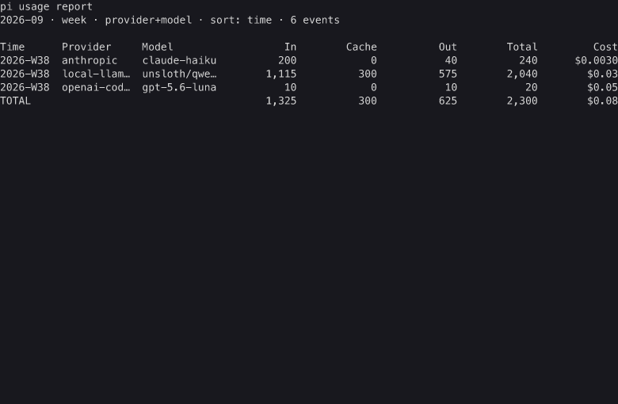

# usage extension

LLM token and cost reporting across all pi sessions: every `.jsonl`
under `~/.pi/agent/sessions/`, all working directories, including
subagent sessions.

## Screenshots

The TUI (`/usage`) over the fixture session files, all-time window:



The CLI (`pi-usage report --month 2026-09`):



## What is counted

A usage event is one recorded LLM call:

- an assistant message (its own provider and model)
- a tool result that did nested LLM work (no provider of its own)
- a compaction or branch summary (no provider of its own)

Forked and cloned sessions copy their ancestor's lines byte-identical,
so each distinct line counts once (ADR 0009). Events without a provider
are attributed to the model active at their position in the entry tree
(ADR 0008). A partial trailing line in a live session is skipped.
Zero-only events (aborted calls, unmeasured work) are dropped: they
cannot change a total, and keeping them would render empty rows.

## /usage (TUI)

Opens the interactive report. One scan on open, then all filtering
happens in memory. Every knob is a key, and the legend at the bottom
always shows them:

| Key | Knob | Values |
| --- | --- | --- |
| `b` | time bucket | day, week, month |
| `w` | time window | 7d, 30d, 90d, 1y, all |
| `g` | group by | provider+model, provider, model |
| `p` | provider filter | cycles the providers, none |
| `m` | model search | type a substring |
| `s` | sort | time, tokens, cost |
| `c` | columns | full, compact (cache merged) |
| `d` / `enter` | detail | raw provider/model pairs under the row |
| `r` | rescan | re-read the session files |
| `j` / `k` | rows | move the cursor |
| `esc` | close | |

Defaults: last 30 days, week buckets, provider+model groups, sorted by
time, a grand total row at the bottom.

Numbers are compact in the TUI: exact under 10,000, then k/M/B (a
12-digit count takes four columns). Exact digits live in the CLI and in
`--json`.

In headless modes the command prints the same default report: a notify
record in RPC mode, the console in print mode.

## usage_report (agent tool)

With no arguments it queues `/usage` so the user gets the TUI. With
arguments it returns the report as text:

- `bucket`: `day` | `week` | `month`
- `window`: `7d` | `30d` | `90d` | `1y` | `all`
- `group`: `provider` | `model`

## pi-usage (CLI)

```
pi-usage report [--by day|week|month] [--by provider|model]
                [--since 7d|30d|90d|1y|all] [--month YYYY-MM] [--json]
pi-usage sessions
pi-usage help
```

Default report: last 30 days, week buckets, provider+model groups.
`--json` emits rows with the raw provider/model pairs per row.
`sessions` lists every session file with its totals (shared fork
history is attributed to the first file scanned).

On a TTY narrower than 120 columns the report renders the compact
column set (cache merged). Piped output always renders the full set.

## Canonical identity

Grouping uses a Canonical identity: provider and model folded by a
small rule table in `lib/identity.ts`.

- `llama.cpp`, `llama-server=http://127.0.0.1:8080`, and
  `crossbar-llamacpp-127-0-0-1-8080` are one provider: `local-llamacpp`
- `omni` stays distinct: it is a remote provider with its own billing
- model ids are lowercased, a trailing `:QUANT` is stripped, and a
  `-GGUF` infix is stripped, so `unsloth/Qwen3.8-27B-GGUF:Q4_K_XL` and
  `unsloth/qwen3.8-27b` are one line
- any name no rule touches stays raw

The `d` key and `--json` expose the raw pairs behind each folded row.

## Data path

The scan root is `~/.pi/agent/sessions/`, overridable with the
`PI_SESSIONS_DIR` environment variable (the tests use it to scan
fixtures).
